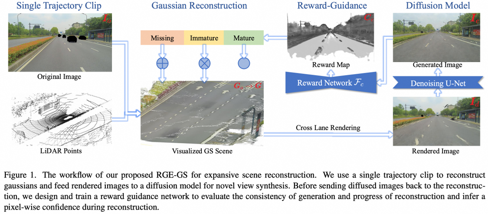

# RGE-GS
> Sicong Du†, Jiarun Liu†, Qifeng Chen, Hao-Xiang Chen, Tai-Jiang Mu, Sheng Yang*

This is the official implementation of **RGE-GS: Reward-Guided Expansive Driving Scene Reconstruction via Diffusion Priors** (ICCV 2025).

<!-- [[Paper](https://arxiv.org/abs/2506.21547)] [[Project Page](https://sam4d-project.github.io/)]. -->

## Abstract
A single-pass driving clip frequently results in incomplete scanning of the road structure, making reconstructed scene expanding a critical requirement for sensor simulators to effectively regress driving actions. Although contemporary 3D Gaussian Splatting (3DGS) techniques achieve remarkable reconstruction quality, their direct extension through the integration of diffusion priors often introduces cumulative physical inconsistencies and compromises training efficiency. To address these limitations, we present RGE-GS, a novel expansive reconstruction framework that synergizes diffusion-based generation with reward-guided Gaussian integration. The RGE-GS framework incorporates two key innovations: First, we propose a reward network that learns to identify and prioritize consistently generated patterns prior to reconstruction phases, thereby enabling selective retention of diffusion outputs for spatial stability. Second, during the reconstruction process, we devise a differentiated training strategy that automatically adjust Gaussian optimization progress according to scene converge metrics, which achieving better convergence than baseline methods. Extensive evaluations of publicly available datasets demonstrate that RGE-GS achieves state-of-the-art performance in reconstruction quality.

  

## Acknowledgement

We gratefully acknowledge the developers of the following open-source projects and datasets, whose foundational tools enabled our research: [Scaffold-GS](https://github.com/city-super/Scaffold-GS), [Para-Lane](https://nizqleo.github.io/paralane-dataset/), among others.